# P452 Project 1

# Checkpoint Questions

## Q1.1: Repository and Cloud Deployment

Github Repository URL: https://github.com/Xiaoyuc0625/PHYS-45200

## Q1.2: The Parameter Control Loop

**Answer:** 

*Figure: a 2-qubit circuit with measurements.*

*Figure: `Ry(θ)` logic gate illustration.*

The screenshot of the circuit and the resulting histogram is shown above. A y-rotation gate `Ry(θ)` to `q0` is applied with the value of `θ` being adjustable, followed by a CNOT (`q0 → q1`) gate. Doing a logic check by sliding the phase to `θ = π` gives the measured quantum state of `|11⟩` with `100%` probability, which is expected according to the logic gate `Ry(θ)`. If the slider failed to pass `theta = pi` to my backend, the measured output would not collapse to `|11>` with unity.

---

## Q1.3: 10-Qubit Visualization

**Answer:**

*Figure: A screenshot of my app rendering a 10-qubit GHZ state circuit.*

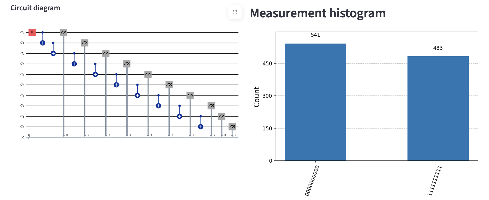

The prepared state is: `|GHZ> = ( |0> + |1023> ) / sqrt(2)`, and after measuring every qubits, the histogram has two components at `0000000000` and `1111111111`, with 50% measurement probability of each.

---

## Q1.4: Unitarity and State Recovery

**Answer:**

The initial state is prepared as `( |201> + |425> ) / sqrt(2)`, where `|201⟩ = |0011001001⟩` and `|425⟩ = |0110101001⟩`.

*Figure: Circuit for the `(|0011001001⟩ + |0110101001⟩)` state:*

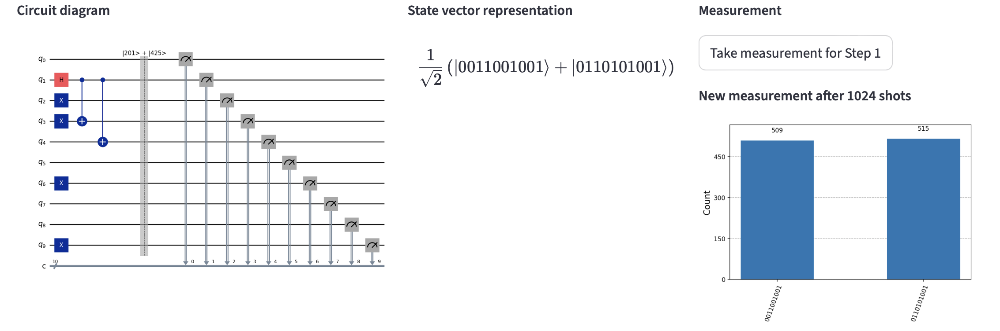

*Figure: 9 CNOT Chain applied to the state, with resulting state representations and the measurements*

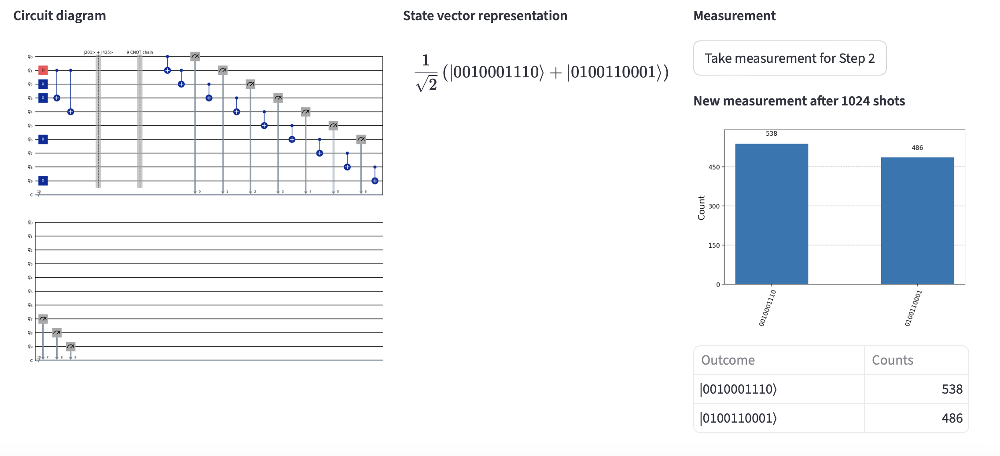

*Figure: Reversed 9 CNOT Chain applied to recover the initial `(|0011001001⟩ + |0110101001⟩)` state:*

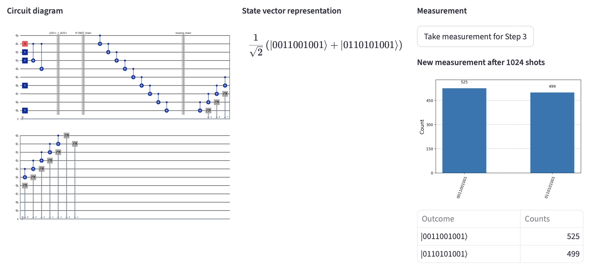

Each CNOT gate is unitary, and thus the nine-gate chain is unitary. Applying the same CNOTs in reverse order implements the inverse operation, which returns the quantum state and measurement probabilities to the initial state and thus confirms the unitarity of the gate operation.

---

## Q2.1 Teleportation

**Answer:**

Alice has a qubit in the state `|q0⟩ = (2|0⟩ + |1⟩) / √5` to be teleported to Bob.

*Figure: A screenshot of 3-qubit teleportation circuit*

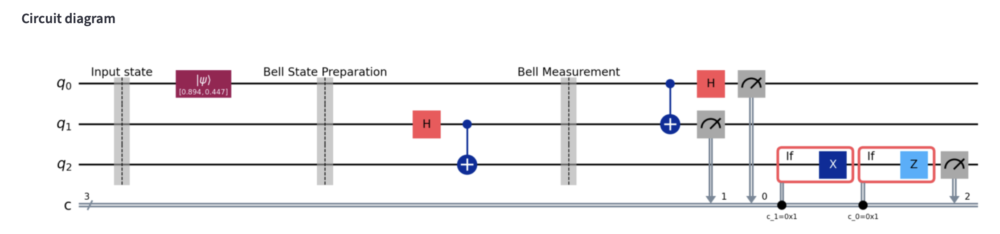

A screenshot of 3-qubit teleportation circuit is shown above. There are three stages respectively: "Input State" stage that generate `|q0⟩`, "Bell State Preparation" stage that generates a Bell pair for Alice and Bob, and finally "Bell Measurement" stages that measures Alice's two qubits, and the conditional `X` and `Z` corrections reconstruct the input state on Bob's qubit

*Figure: Bob's measurement result of the 3-qubit teleportation circuit*

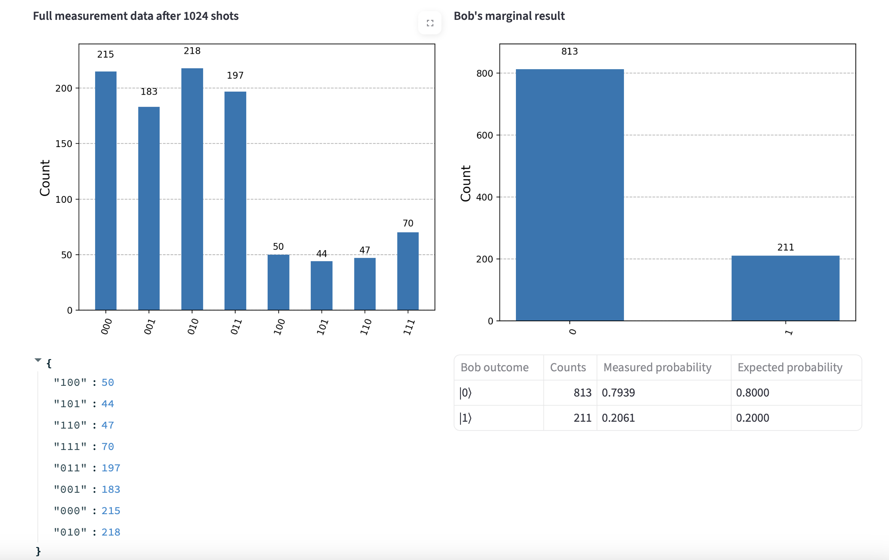

---

## Q2.2

**Answer:**

*Figure: the circuit required to perform a CNOT between `q0` and `q4` in a linear chain `(0–1–2–3–4)`*

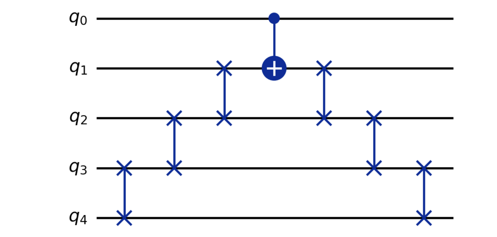

*Figure: A total of 19 CNOT gates to be used once decomposing the SWAP gates*

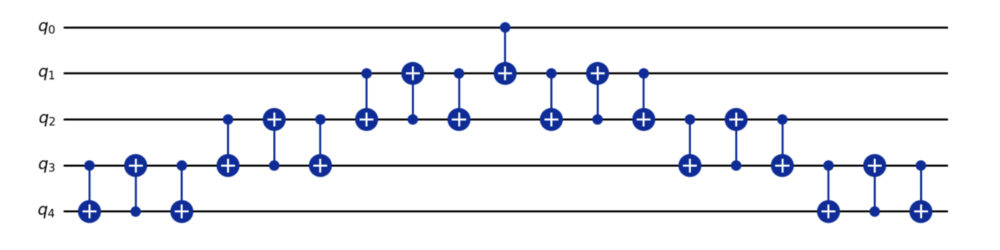

To perform `CNOT(q0 -> q4)` on a chain `0-1-2-3-4`, direct the target next to `q0` using 3 SWAP gates, apply one near-neighbor CNOT, and then undo the routing using another 3 SWAP gates.

Since each SWAP decomposes into 3 CNOTs, the total number of CNOT gate after decomposation is `6 * 3 + 1 = 19`.

---

## Q2.3 Teleportation (Continued)

**Answer:**

*Figure: Result of running the teleportation circuit 1024 times with initial state `|0⟩`*

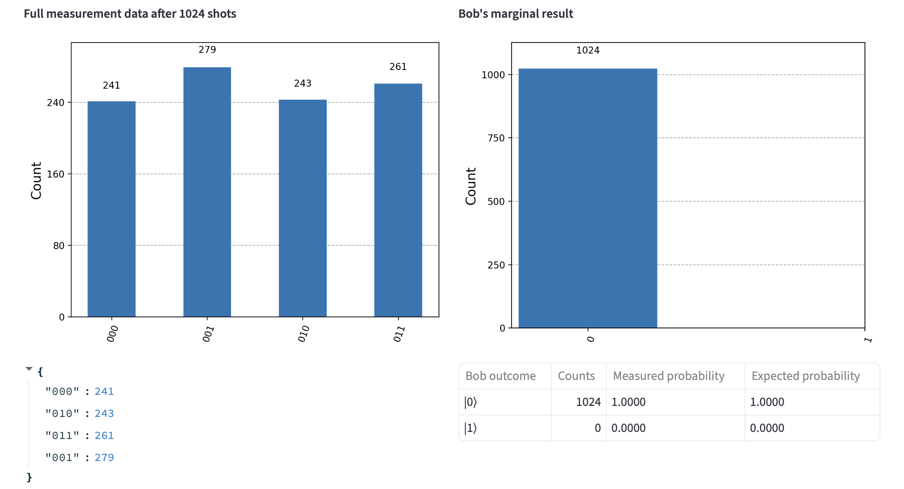

Given Alice's input of `|0>`, Bob will measure `|0>` with probability 1 in an ideal simulator. Small deviation from 100% may come from noise, decoherence of entangled pair, and measurement error in an actual hardware.

---

## Q3.1: Circuit Architecture

**Answer:**

*Figure: The circuit diagram of Fermi-Hubbard Model for exactly one Trotter step*

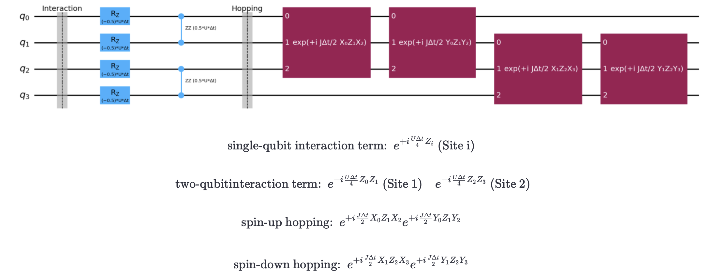

- the **interaction term** is implemented by the `RZ` gate on every qubit and the `RZZ` gate on `(q0, q1)` and `(q2, q3)` to account for the interaction hamiltonian `U = (I − Z↑ − Z↓ + Z↑Z↓)/4` ;
- the **hopping term** is implemented by `RXX` and `RYY` rotations between `(q0, q2)` and `(q1, q3)`, where the required Jordan–Wigner Z-string for anticommutation is applied using the extra Z gates to the qubit between the two qubits of `RXX` and `RYY` rotations.

---

## Q3.2: Non-Interacting Dynamics (`U = 0`)

**Answer:**

*Figure: A plot of the probability of finding the spin-up electron at site 2 (`|0010⟩`) as a function of time `t ∈ [0, π]`"

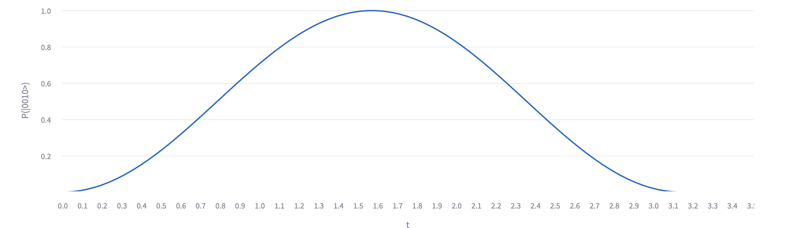

With `U = 0`, `J = 1`, and initial state `|1000>`, the dynamics indicates coherent hopping of a single spin-up fermion between sites 1 and 2. The probability of state `|0010>` oscillates sinusoidally and reaches unity at time `t = π/2`. This is equivalent to the Rabi oscillation between a two level system, where the Rabi frequency can be characterized to be `Ω​=2J`.

---

## Q3.3: Strong Interactions and Mott Physics

Set `U = 10` and `J = 1`. Prepare the initial state `|1100⟩` (two electrons at Site 1).

**Discussion:** How does the large `U` value affect the tunneling rate? Relate your observations to the physics of a Mott insulator.

**Answer:**

*Figure: A plot of the probability of the system remaining in `|1100⟩` versus transitioning to a “doublon” state at Site 2 (`|0011⟩`)

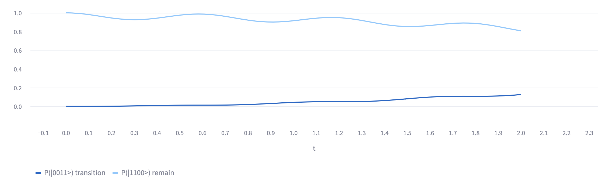

With `U = 10` and initial state `|1100>`, the large interaction energy strongly suppresses the hopping of the two spins. The probability of remaining in `|1100>` stays high, while the transfer to `|0011>` is suppressed and is much slower than in the non-interacting scenario. This reflects the physics of a Mott insulator, where strong on-site repulsion blocks charge motion, reducing tunneling and localizing the particles.
