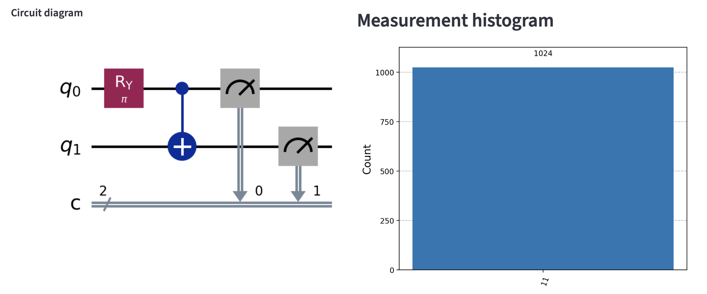

# P452 Project 1 — Written Answers

# Checkpoint Questions

## Q1.1: Repository and Cloud Deployment

Github Repository URL: https://github.com/Xiaoyuc0625/PHYS-45200

## Q1.2: The Parameter Control Loop

Demonstrate that your UI successfully passes variables to the quantum backend.

**Task:** Build a 2-qubit circuit. Apply a y-rotation gate `Ry(θ)` to `q0` followed by a CNOT (`q0 → q1`). Set your slider to `θ = π` (approx. `3.14`).

**Deliverable:** A screenshot of the resulting histogram.

**Logic Check:** Why does measuring the state `|11⟩` with approximately `100%` probability prove that your backend is receiving the slider value correctly?

**Answer:** 

The screenshot of the circuit and the resulting histogram is shown above. A y-rotation gate `Ry(θ)` to `q0` is applied with the value of `θ` being adjustable, followed by a CNOT (`q0 → q1`) gate. Doing a logic check by sliding the phase to `θ = π` gives the measured quantum state of `|11⟩` with `100%` probability, which is expected according to the logic gate `Ry(θ)`, and it proves that my backend is receiving the slider value correctly.
---

## Q1.3: 10-Qubit Visualization

Provide a screenshot of your app rendering a 10-qubit GHZ state circuit:

\[
|GHZ\rangle = \frac{|0\rangle + |1023\rangle}{\sqrt{2}}
\]

Here the base-10 representation of the qubit state is given by, for example, `|1023⟩ = |1111111111⟩`.

**Constraint:** The circuit must be rendered visually, not just as text. Use Qiskit’s Matplotlib drawer, for instance. Ensure the image is scaled correctly so all 10 wires are legible on the screen.

---

## Q1.4: Unitarity and State Recovery

Demonstrate the reversibility of quantum operations across all 10 qubits.

**Protocol:**
1. Develop a circuit to prepare the qubits in the state  
   \[
   2^{-1/2} (|201\rangle + |425\rangle)
   \]
   where `|201⟩ = |0011001001⟩`.
2. Apply a chain of 9 two-qubit gates of your choice to all qubits  
   (e.g. CNOT `q0 → q1`, `q1 → q2`, ..., `q8 → q9`). Report the resulting non-zero amplitudes of the final state vector.
3. Develop a sequence of gates to reverse the operation and convert the qubits back to the initial state.

**Deliverable:** Provide the circuit and state vector representation after each step.

**Analysis:** Explain how this confirms the unitarity of the gate operation.

---

## Q2.1

Alice has a qubit in the state

\[
|q_0\rangle = 5^{-1/2}(2|0\rangle + |1\rangle)
\]

to be teleported to Bob.

Provide a screenshot of your 3-qubit teleportation circuit from your simulator. Show that you generate `|q0⟩`, and teleport the state to Bob by sharing an entangled qubit pair.

Label the **Bell State Preparation** and **Bell Measurement** stages.

---

## Q2.2

Draw the circuit required to perform a CNOT between `q0` and `q4` in a linear chain `(0–1–2–3–4)`.

How many total CNOT gates are used once you decompose the SWAP gates?

---

## Q2.3

Run your teleportation circuit 1024 times.

If Alice starts with the state `|0⟩`, what is the measured probability of Bob finding `|0⟩`?

Explain any deviation from `100%`.

---

## Q3.1: Circuit Architecture

Provide the circuit diagram for exactly one Trotter step generated by your simulator.

**Required Answer:** Identify and label the gates corresponding to the hopping term and the interaction term. If your mapping requires a Z-string to maintain fermionic anti-commutation during the `q0 → q2` hop, highlight where it appears.

---

## Q3.2: Non-Interacting Dynamics (`U = 0`)

Set `U = 0` and `J = 1`. Initialize the system in the state `|1000⟩` (one `↑` electron at Site 1).

**Required Answer:** Plot the probability of finding the electron at Site 2 (`|0010⟩`) as a function of time `τ ∈ [0, π]`.

**Discussion:** At what time `τ` is the transfer of the electron from Site 1 to Site 2 complete? Compare this to the analytical “Rabi” frequency of a two-level system.

---

## Q3.3: Strong Interactions and Mott Physics

Set `U = 10` and `J = 1`. Prepare the initial state `|1100⟩` (two electrons at Site 1).

**Required Answer:** Plot the probability of the system remaining in `|1100⟩` versus transitioning to a “doublon” state at Site 2 (`|0011⟩`).

**Discussion:** How does the large `U` value affect the tunneling rate? Relate your observations to the physics of a Mott insulator.

## Q1.1 Repository and Cloud Deployment
After you push this project to GitHub and deploy `app.py` on Streamlit Cloud, insert the two URLs here.

- GitHub repository: `...`
- Live Streamlit app: `...`

## Q1.2 The Parameter Control Loop
The circuit applies `Ry(theta)` to `q0` and then `CNOT(q0 -> q1)`. When `theta = pi`, the state evolves as

`|00> -> |10> -> |11>`.

Therefore, an ideal histogram with nearly 100% of shots in `11` shows that the slider value really reached the backend. If the slider failed to pass `theta = pi`, the output would not collapse to `|11>` with unit probability.

## Q1.3 10-Qubit Visualization
Use `ghz10_circuit()` and the Streamlit **10-qubit GHZ** preset. The circuit prepares

`(|0000000000> + |1111111111>) / sqrt(2)`.

The expected measurement histogram has dominant peaks at `0000000000` and `1111111111`, each near 50%.

## Q1.4 Unitarity and State Recovery
The initial state is prepared as

`( |201> + |425> ) / sqrt(2)`.

A chain of 9 CNOT gates maps the basis components reversibly. Because each gate is unitary, the full circuit is unitary, and applying the inverse chain in reverse order recovers the initial state exactly. Equality of the recovered statevector with the initial one confirms reversibility and hence unitarity.

## Q2.1 Teleportation of (2|0> + |1>) / sqrt(5)
The teleportation circuit initializes Alice's qubit in

`|psi> = (2|0> + |1>) / sqrt(5)`.

The **Bell State Preparation** stage entangles qubits 1 and 2. The **Bell Measurement** stage measures Alice's two qubits, and the conditional `X` and `Z` corrections reconstruct the input state on Bob's qubit.

## Q2.2 Long-Distance CNOT in a Linear Chain
To perform `CNOT(q0 -> q4)` on a chain `0-1-2-3-4`, route the target next to `q0` using 3 SWAPs, apply one nearest-neighbor CNOT, then undo the routing using 3 more SWAPs.

Since each SWAP decomposes into 3 CNOTs, the total number of CNOTs is

`6 * 3 + 1 = 19`.

## Q2.3 Teleportation Statistics for Input |0>
For input `|0>`, Bob should measure `|0>` with probability 1 in the ideal simulator. Any small deviation from 100% in a finite-shot histogram comes only from sampling noise because the circuit is simulated rather than run on noisy hardware.

## Q3.1 One Trotter Step
In the circuit produced by `one_trotter_step_hubbard(U, J, dt)`:

- the **interaction term** is implemented by the `RZZ`-based blocks on `(q0, q1)` and `(q2, q3)`;
- the **hopping term** is implemented by `RXX` and `RYY` rotations between `(q0, q2)` and `(q1, q3)`;
- the required Jordan–Wigner **Z-string** is shown explicitly using `CZ` gates surrounding the long-range hopping block.

## Q3.2 Non-Interacting Dynamics (U = 0)
With `U = 0`, `J = 1`, and initial state `|1000>`, the dynamics reduce to coherent hopping of a single spin-up fermion between sites 1 and 2. The probability of state `|0010>` oscillates sinusoidally and reaches 1 at the first full transfer time.

For the ideal two-level Hamiltonian with matrix element `J`, the transition probability is `sin^2(J tau)`, so complete transfer first occurs at

`tau = pi / 2`.

## Q3.3 Strong Interactions and Mott Physics
With `U = 10` and initial state `|1100>`, the large interaction energy strongly penalizes doublon motion. The probability of remaining in `|1100>` stays high, while the transfer to `|0011>` is suppressed and much slower than in the weakly interacting case.

This is the characteristic Mott-insulator picture: strong on-site repulsion blocks charge motion, reducing tunneling and localizing the particles.
